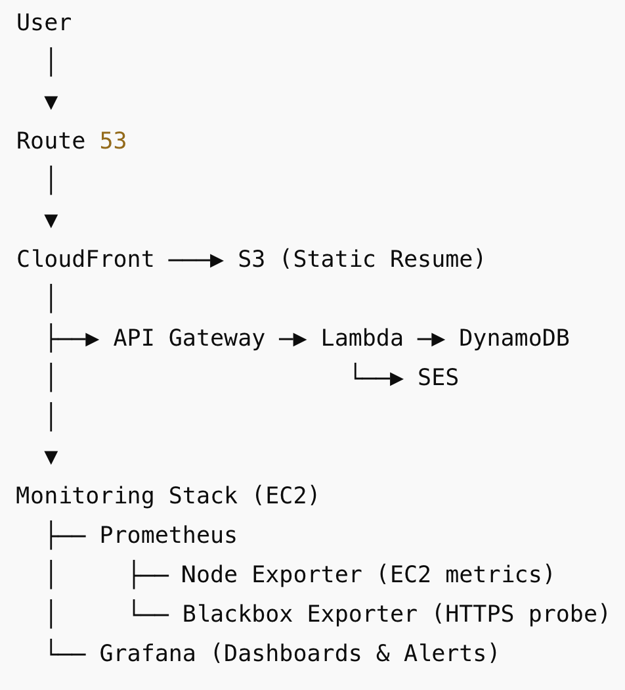
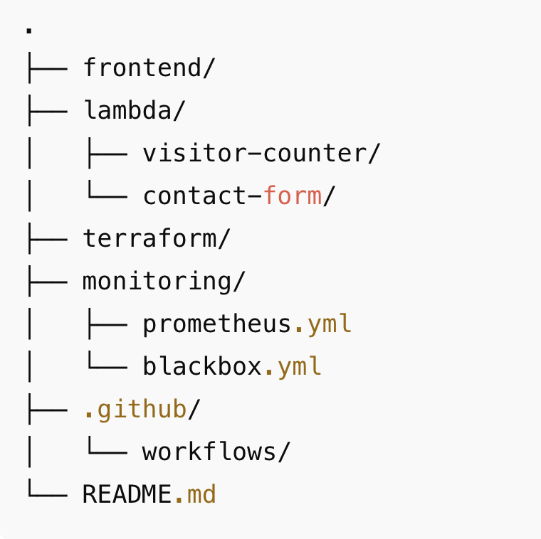

# My AWS Cloud Resume 🌐📄

This repository contains my **AWS-based Cloud Resume project**, built as part of the **Cloud Resume Challenge**.

Beyond the core challenge requirements, this project has been extended with **production-style monitoring and alerting using Prometheus and Grafana**, reflecting real-world Cloud / DevOps engineering practices.

[The Cloud Resume Challenge Tutorial (Haiyue Yuan)](https://dev.to/yuan_hy/the-cloud-resume-challenge-my-cloud-adventure-5439)

## Table of Contents 📚

- [Introduction](#introduction)
- [Project Overview](#project-overview)
- [Core Technologies & Services](#Core Technologies & Services)
- [System Architecture](#System Architecture)
- [Request Flow](#Request Flow)
- [Infrastructure as Code & CI/CD](#Infrastructure as Code & CI/CD)
- [Directory Structure](#directory-structure)
- [Contributing](#contributing)
- [License](#license)

## Introduction

This project is more than a static online resume. It is a **cloud-native, observable web application** designed to demonstrate how modern AWS-based systems are built, deployed, monitored, and operated.

In addition to completing the Cloud Resume Challenge requirements, I focused on:

- Infrastructure automation
- Serverless backend design
- System observability and alerting
- Production-style architecture decisions

## Project Overview

The Cloud Resume project delivers:

- A globally distributed static resume website
- Serverless backend APIs for dynamic functionality
- Infrastructure provisioned using **Terraform**
- Automated deployments via **GitHub Actions**
- A **monitoring and alerting stack** using Prometheus and Grafana

The result is a system that is not only deployed, but also **observable, debuggable, and operationally meaningful**.

## Core Technologies & Services

- ### AWS Services

  - **Amazon S3** – Static website hosting
  - **Amazon CloudFront** – Global CDN with HTTPS
  - **Amazon Route 53** – DNS and custom domain routing
  - **AWS Lambda** – Serverless backend logic
  - **Amazon DynamoDB** – Persistent storage for visitor counts
  - **Amazon API Gateway** – REST APIs
  - **Amazon SES** – Email delivery for contact form submissions
  - **Amazon EC2** – Dedicated monitoring host

  ### DevOps & Observability

  - **Terraform** – Infrastructure as Code (IaC)
  - **GitHub Actions** – CI/CD automation
  - **Prometheus** – Metrics collection and querying
  - **Node Exporter** – EC2 host-level metrics
  - **Blackbox Exporter** – Synthetic HTTPS monitoring
  - **Grafana** – Dashboards and alerting

## System Architecture

Check out the architecture diagram below to see how all these pieces fit together:

High-level system architecture:

### Monitoring & Observability

To ensure the system is **observable and production-ready**, a dedicated monitoring stack runs on EC2.

**Metrics Collection:**

- **Node Exporter**
  - CPU, memory, disk, and network metrics for the monitoring host
- **Blackbox Exporter**
  - HTTPS availability monitoring for `https://hi-yuan.com`
  - HTTP response status codes
  - TLS handshake success
  - End-to-end request latency

**Visualization:**

- Grafana dashboards provide real-time visibility into:
  - EC2 host health
  - Website uptime and latency
  - HTTP/TLS probe results

**Alerting:**

- Alerts trigger when website availability fails (`probe_success < 1`)
- Time-based thresholds reduce alert noise
- Notifications are delivered via email

This monitoring layer transforms the project from a static demo into a **continuously observed system**, similar to how real-world services are operated.

## Request Flow

**Website Request:**

1. User accesses `hi-yuan.com`
2. Route 53 resolves the domain to CloudFront
3. CloudFront serves static content from S3 over HTTPS

**Visitor Counter:**

1. Frontend JavaScript calls API Gateway
2. API Gateway invokes a Lambda function
3. Lambda updates and retrieves data from DynamoDB
4. Visitor count is returned to the frontend

**Monitoring Flow:**

1. Prometheus scrapes:
   - `node_exporter` for EC2 metrics
   - `blackbox_exporter` for website probes
2. Grafana queries Prometheus
3. Dashboards visualize metrics and alerts trigger on failures

## Infrastructure as Code & CI/CD

**Infrastructure as Code**

Terraform is used to provision and manage:

- Core AWS resources
- IAM roles and permissions
- Networking and security components

**CI/CD**

GitHub Actions automates:

- Frontend deployments to S3
- CloudFront cache invalidation
- Safe and repeatable releases

## Directory Structure

## Contributing

Got some cool ideas to make this project even better? Awesome! Fork the repository, make your changes, and submit a pull request. Contributions are always welcome! Let's make this project rock together! 🎉

## License

This project is licensed under the MIT License. Feel free to use and modify the code. See the [LICENSE](https://opensource.org/license/mit) for more details.

---

Thanks for stopping by! I hope you enjoyed exploring my Cloud Resume project as much as I enjoyed building it. If you have any questions or just want to say hi, don't hesitate to reach out! 😊
